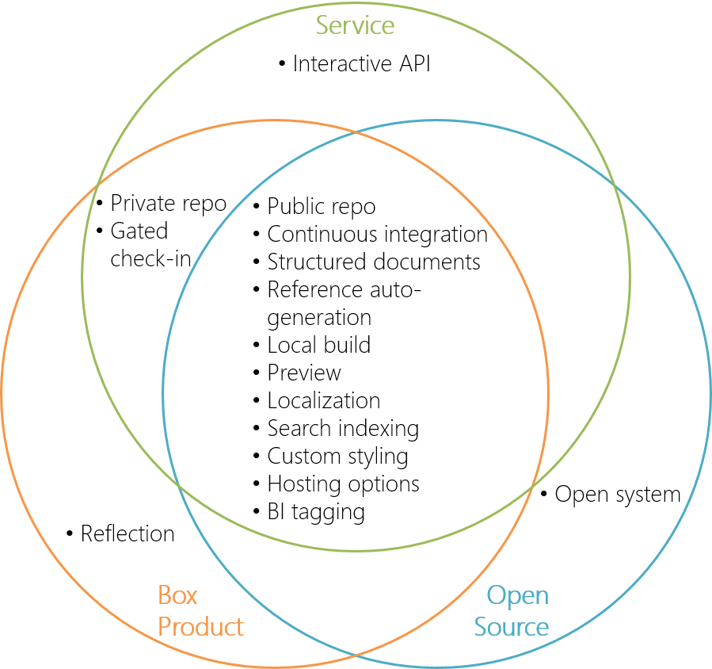
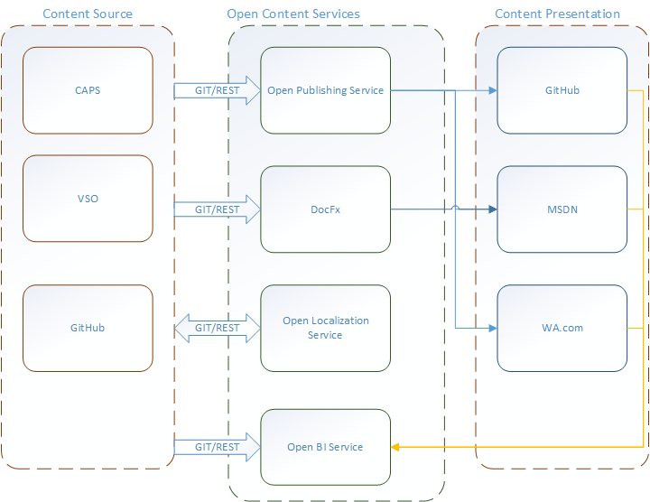

Open Publishing Introduction
=================================
Open Publishing (OP) is a modern content authoring and publish workflow based on markdown and Git. It is built as a set of content services accessible through open standard-based interfaces such as Git. 
 
- Easy to author:
	- Markdown as authoring language
	- Validate and preview your changes locally just as you write the code
	
- Easy to publish:
	- Push your content to Git and wait it to be published automatically
	- Open to multiple endpoint support 

- Easy to collaborate:
	- Use Git (GitHub/VSO) as collaboration interface
	- Contribute/review/comment using pull request

Open Publishing is being developed by the Visual Studio China team. The team owns the MSDN and Technet platforms, as well as other tools related to content authoring and publishing.

1. Why Open Publishing?
-------------

Our legacy documentation processes and tools are not designed for services that are easily consumable by a variety of customers with unique and individual needs. This presents itself in several ways:
- Document releases are moving from years/months releases to weeks/days/several times a day
- Technical documentation is shifting from large size to small, hierarchical to flat, from static to interactive
- Product/Engineering teams and external communities need to directly contribute to content creation/feedback
- Product/Engineering teams prefer to use the same process for code and docs
- Product/Engineering teams are increasingly hosting more docs on their own websites

Without common tools, many teams are building their own tools, sites, etc. This means a lot of fragmentation in processes, tools and environments, which affects productivity and customer experience. 

Although different teams may have different workflows, many content publishing scenarios and requirements are the same. 

Thus, if we can open up the content pipeline piece by piece, teams can use those essential common blocks. We will accomplish this by providing services via Open Publishing. Key benefits:
- Decoupling of content creation and distribution
- Continuous integration
- Open contribution and connected feedback
- Flexible hosting
- Centralized analytics

There would be four core services in Open Publishing
- Reference content auto-generation
- Content publishing
- Localization
- BI

In the future, Open Publishing service would be open sourced to any team in Microsoft, to allow other them to contribute to the codebase and build even more customized solutions.

2. Major Scenarios
------------------
Open Publishing will be created and deployed in Phases. For a up-to-date list of current and future work, please visit [TFS feature request list](https://mseng.visualstudio.com/DefaultCollection/VSChina/_workitems#path=Shared+Queries%2FVSOpenPublishing%2FOpen+Publishing+-+Feature+list&_a=query).

The following are the key scenarios that Open Publishing will cover:

Standardized interface and agile tooling
- Git and Markdown (as well as HTML) are commonly accepted interface and format both internally and externally
- Plenty of additional tools available for different teams to choose according to their existing process and usage

Available and accessible for all
- Internally - product teams as well as content teams
- Externally - open to Microsoft customers for contribution

Different types of documentation
- Conceptual content for getting started, tutorials, etc.
- Reference content for API

Accepting content authored from multiple tool chains, such as
- Rich Content Management systems like CAPS (Content Authoring and Publishing Services) used by teams who like a rich experience to author, localize, and publish content. 
- Git repos, including GitHub and VSO

Multiple hosting environments
- MSDN, TechNet, VisualStudio.com
- Custom domain support

Content management as a service
- Self-managed, flexible content workflow: from provisioning, authoring, staging and reviewing to publishing
- Integrated localization service: get your content localized and published easily
- Connected BI service, established feedback loop and customizable analytics from content creator to consumers
- Consistent SEO approach

3. Service Architecture
-----------------------

